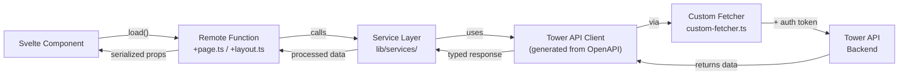
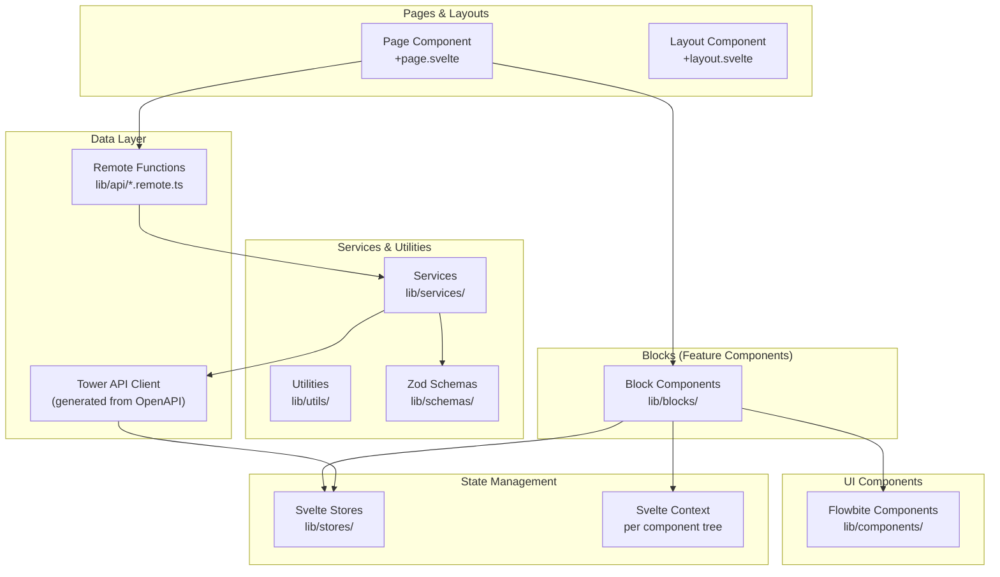

# [Feature Name] - SvelteKit Frontend Design

## Overview

[Provide a brief description of the feature and its purpose. Explain how it fits into the SvelteKit application and what user problem it solves.]

## Architecture

### SvelteKit Data Flow



### High-Level Component Architecture



### Technology Stack

**Frontend Framework**
- **SvelteKit 2.x** - Full-stack framework with file-based routing
- **Svelte 5** - Component framework with reactive primitives (`$state`, `$derived`)
- **TypeScript** - Type safety across all code

**State Management**
- **Svelte Stores** (`writable`, `readable`) - Global app state
- **Svelte Context** - Component tree scoped state
- **SvelteKit Server Data** - Layout/page data loaded server-side

**Styling & Components**
- **Tailwind CSS v4** - Utility-first styling
- **Flowbite Svelte** - Pre-built component library
- **CSS Modules** - Component-scoped styling (when needed)

**Forms & Validation**
- **SvelteKit Superforms** - Progressive form handling
- **Zod** - Runtime schema validation (frontend & server)

**Data Fetching & API**
- **SvelteKit Remote Functions** - Server-side data loading (`+page.ts`, `+layout.ts`)
- **Tower API Client** - Generated TypeScript client from OpenAPI spec (via Orval)
- **Custom Fetcher** - Middleware for auth token injection

**Mapping & Geolocation**
- **MapLibre GL** - Interactive maps via `svelte-maplibre-gl`
- **Turf.js** - Geospatial calculations (clustering, distance, etc.)

**Testing**
- **Vitest** - Unit & integration tests
- **Playwright** - Browser-based component tests

## File Structure

```
src/
├── routes/                     # SvelteKit file-based routing
│   ├── +layout.svelte         # Root layout
│   ├── +layout.ts             # Root data loading (auth, themes)
│   ├── +page.svelte           # Home page
│   ├── [route]/
│   │   ├── +page.svelte       # Route page component
│   │   └── +page.ts           # Route data loading (Remote Functions)
│   └── [route]/[id]/
│       ├── +page.svelte       # Detail page
│       └── +page.ts           # Detail data loading
│
├── lib/
│   ├── blocks/                 # Feature blocks (composite components)
│   │   ├── [FeatureName].svelte
│   │   └── [FeatureName].svelte.test.ts
│   │
│   ├── components/             # Reusable UI components
│   │   ├── [ComponentName].svelte
│   │   └── [ComponentName].svelte.test.ts
│   │
│   ├── api/                    # Remote functions (server-side data)
│   │   └── [feature].remote.ts # Server functions called from +page.ts
│   │
│   ├── services/               # Business logic
│   │   └── [feature].service.ts
│   │
│   ├── stores/                 # Global state (Svelte stores)
│   │   └── [feature].store.ts
│   │
│   ├── schemas/                # Zod validation schemas
│   │   └── [feature].schema.ts
│   │
│   ├── utils/                  # Helper functions
│   │   └── [feature].utils.ts
│   │
│   ├── gen/
│   │   └── tower/              # Generated API client (Orval)
│   │       ├── index.ts
│   │       └── [endpoints].ts
│   │
│   └── custom-fetcher.ts       # Auth token injection for API calls
│
└── app.d.ts                    # Global TypeScript declarations
```

## Components and Interfaces

### Page Data Loading Pattern

```typescript
// src/routes/[feature]/+page.ts
import { load } from '$app/forms';
import { query } from '$lib/api/[feature].remote';

export const load = (async ({ locals }) => {
  // Load server-side data using Remote Functions
  const [data, error] = await query.getFeatureData();

  return {
    data,
    error,
    session: locals.session // Auth info from root layout
  };
}) satisfies PageLoad;
```

### Remote Function (Server-Side)

```typescript
// src/lib/api/[feature].remote.ts
import { featureService } from '$lib/services/feature.service';

// Server-side function that can be called from load() or form actions
export const query = {
  async getFeatureData() {
    try {
      const data = await featureService.fetchData();
      return [data, null];
    } catch (error) {
      return [null, error];
    }
  }
};
```

### Service Layer

```typescript
// src/lib/services/[feature].service.ts
import { towerApi } from '$lib/api/client'; // Tower API client (generated from OpenAPI)

class FeatureService {
  async fetchData() {
    // Generated API client automatically gets auth token via custom-fetcher
    const response = await towerApi.getFeatures();
    return response.data;
  }

  async createItem(data: CreateItemInput) {
    const validated = createItemSchema.parse(data);
    return towerApi.createFeature(validated);
  }
}

export const featureService = new FeatureService();
```

### Block Component (Feature UI)

```typescript
// src/lib/blocks/FeatureBlock.svelte
<script lang="ts">
  import type { PageData } from './$types';
  import { featureStore } from '$lib/stores/feature.store';
  import ItemComponent from '$lib/components/Item.svelte';

  let { data }: { data: PageData } = $props();

  let items = $derived.by(() => {
    // Reactive: recomputes when feature store changes
    return $featureStore.items;
  });
</script>

<div class="grid gap-4">
  {#each items as item (item.id)}
    <ItemComponent {item} />
  {/each}
</div>
```

### Form with Validation

```typescript
// src/lib/components/CreateForm.svelte
<script lang="ts">
  import { superForm } from 'sveltekit-superforms';
  import { createItemSchema } from '$lib/schemas/feature.schema';

  let form = superForm(data.form, {
    validators: createItemSchema,
    onUpdate: async ({ form }) => {
      if (form.valid) {
        await featureService.createItem(form.data);
      }
    }
  });
</script>

<form method="POST" action="?/create" use:enhance={form.enhance}>
  <input name="title" bind:value={$form.title} />
  {#if $errors.title}<span>{$errors.title}</span>{/if}
  <button type="submit">Create</button>
</form>
```

### Global State Store

```typescript
// src/lib/stores/feature.store.ts
import { writable, derived } from 'svelte/store';

interface FeatureState {
  items: Item[];
  loading: boolean;
  error: string | null;
}

function createFeatureStore() {
  const { subscribe, set, update } = writable<FeatureState>({
    items: [],
    loading: false,
    error: null
  });

  return {
    subscribe,
    setItems: (items: Item[]) => update(s => ({ ...s, items })),
    setLoading: (loading: boolean) => update(s => ({ ...s, loading })),
    setError: (error: string | null) => update(s => ({ ...s, error }))
  };
}

export const featureStore = createFeatureStore();
```

### Zod Schema

```typescript
// src/lib/schemas/feature.schema.ts
import { z } from 'zod';

export const createItemSchema = z.object({
  title: z.string().min(3).max(100),
  description: z.string().optional(),
  location: z.object({
    lat: z.number(),
    lng: z.number()
  }).optional()
});

export type CreateItemInput = z.infer<typeof createItemSchema>;
```

## Authentication Flow

```typescript
// Auth is loaded once in root +layout.ts
// Available as locals.session in all page load functions
// Access token auto-injected in custom-fetcher.ts

// Root layout
export const load = (async ({ locals }) => {
  const session = await auth();

  return {
    session,
    theme: localStorage.getItem('theme')
  };
}) satisfies LayoutLoad;

// Any page can access session via PageData
export const load = (async ({ locals }) => {
  if (!locals.session?.user) {
    throw redirect(302, '/login');
  }

  return { /* ... */ };
}) satisfies PageLoad;
```

## Mapping & Geolocation Implementation

```typescript
// Using MapLibre GL for interactive maps
import { MapLibre } from 'svelte-maplibre-gl';
import * as turf from '@turf/turf';

// Component
<script>
  let features = $state([]);

  async function addClusteredLayer() {
    const clustered = turf.clustersDbscan(
      turf.featureCollection(features),
      { maxDistance: 50, minPoints: 3 }
    );
    // Add to map
  }
</script>

<MapLibre
  style="https://basemaps.cartocdn.com/gl/voyager-gl-style/style.json"
>
  {#each features as feature (feature.id)}
    <Source {data}>
      <Layer type="circle" paint={paintConfig} />
    </Source>
  {/each}
</MapLibre>
```

## Error Handling

### Component Error Boundary

```typescript
// src/routes/+error.svelte
<script>
  import { page } from '$app/stores';
</script>

<div class="error-container">
  <h1>Oops! {$page.status}</h1>
  <p>{$page.error?.message}</p>
  <a href="/">Go Home</a>
</div>
```

### API Error Handling

```typescript
// In services
async function fetchData() {
  try {
    return await API.getData();
  } catch (error) {
    if (error.response?.status === 401) {
      // Redirect to login via error boundary
      throw error('Unauthorized');
    }
    if (error.response?.status === 404) {
      return null; // Handle gracefully
    }
    // Log error for monitoring
    console.error('Unexpected error:', error);
    throw new Error('Failed to load data');
  }
}
```

## Testing Strategy

### Unit Tests (Vitest + Node Environment)

```typescript
// src/lib/services/feature.service.test.ts
import { describe, it, expect, vi } from 'vitest';
import { featureService } from './feature.service';

describe('FeatureService', () => {
  it('should fetch items', async () => {
    const result = await featureService.fetchData();
    expect(result).toBeDefined();
  });
});
```

### Component Tests (Vitest + Browser Environment)

```typescript
// src/lib/blocks/FeatureBlock.svelte.test.ts
import { describe, it, expect } from 'vitest';
import { render, screen } from '@testing-library/svelte';
import FeatureBlock from './FeatureBlock.svelte';

describe('FeatureBlock', () => {
  it('should render items', () => {
    render(FeatureBlock, { props: { data: mockData } });
    expect(screen.getByText(/item/i)).toBeInTheDocument();
  });
});
```

### Integration Tests

```typescript
// Test page load with remote functions
describe('Feature Page Load', () => {
  it('should load data and render', async () => {
    const { page } = await load({ locals: { session: null } });
    expect(page.data.items).toBeDefined();
  });
});
```

## Performance Considerations

### Optimization Strategies

1. **Code Splitting** - SvelteKit auto-splits routes
2. **Lazy Loading** - Use `+page.server.ts` for critical data only
3. **Component Preloading** - Use `eager` on frequently accessed components
4. **Image Optimization** - Use `<enhanced:img>` for responsive images
5. **Store Subscription Cleanup** - Unsubscribe from stores in component cleanup
6. **Batch Updates** - Group multiple store updates to reduce reactivity runs

### Server-Side Rendering (SSR)

```typescript
// Configure SSR per route as needed
export const ssr = true;  // Default: render on server
export const prerender = true;  // Pre-build static pages
export const csr = true;  // Enable client-side enhancement
```

## Security Considerations

### Input Validation

```typescript
// All forms must use Zod schemas
const userInputSchema = z.object({
  query: z.string().max(100).trim(),
  lat: z.number().min(-90).max(90),
  lng: z.number().min(-180).max(180)
});
```

### Authentication & Authorization

- Auth.js handles session management via Keycloak OIDC
- Check `locals.session` in load functions for protected routes
- Access token automatically injected in API requests
- Never expose sensitive data in client-side stores

### Content Security

- Use `{@html}` sparingly and only with trusted content
- Sanitize user input before display
- Use Tailwind's built-in escaping for dynamic classes

## Assumptions and Dependencies

### Technical Assumptions
- Tower API available at configured endpoint with OpenAPI spec
- Keycloak OIDC provider configured and accessible
- MapLibre basemap service available
- Browser with ES2020+ support

### External Dependencies
- `@auth/sveltekit` - Authentication
- `svelte-maplibre-gl` - Mapping
- `sveltekit-superforms` - Form handling
- `zod` - Validation
- `@turf/turf` - Geospatial calculations

### Risk Mitigation
- **API Outage**: Implement error states and fallback UI
- **Auth Failure**: Graceful redirect to login with clear messaging
- **Map Rendering**: Fallback to list view or error state
- **Large Datasets**: Implement pagination and lazy loading

---

**Requirements Traceability**: This design addresses requirements [list requirement IDs from requirements.md]

**Architecture Review**: [Draft/In Review/Approved]

**Last Updated**: [Date]

**Tech Lead**: [Name]
